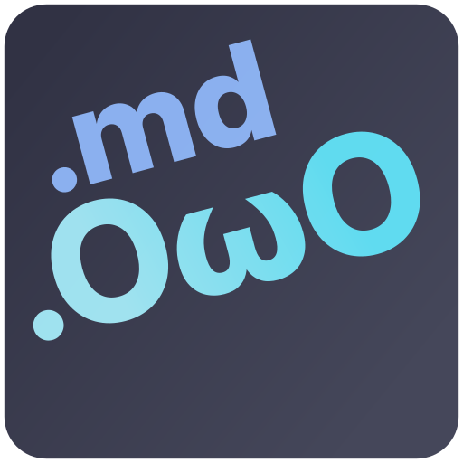

# owomd :3

A custom markdown format for gays, by gays :3c

<div align="center">
  
</div>

Made with &lt;3 by [gayboi.club](https://gayboi.club)

`owomd/python` is a python project that compiles custom `.md.owo` templates into beautiful, styled HTML files. It natively supports dynamic JSON placeholder injection, codeblock templating, and CSS remote imports :3

## Installation

1. Download the latest binary for your operating system (Windows, macOS, or Linux) from the [Releases page].
2. Place the binary in your project folder, or add it to your system's `PATH` so you can call `owomd` from anywhere.
3. Make sure it has execution permissions (on macOS/Linux: `chmod +x owomd`).

## Usage

You can use `owomd` via the command line. It requires one argument: the path to your template file.

### Live Web Server (On-the-fly Compilation)
If you want to view your `.md.owo` templates as actual web pages natively in your browser, `owomd` has a built-in development HTTP server :3c

```bash
./owomd serve . --port 8080
```
This will host all files in the current directory on `localhost:8080`.
- Navigating to `http://localhost:8080/my_document.md.owo` will compile and serve you the styled HTML on the fly!
- You can pass dynamic JSON variables via the URL query string: 
  `http://localhost:8080/my_document.md.owo?data={"name":"glitchy"}`

### Static File Compilation
If you just want to compile a document statically:

```bash
./owomd my_document.md.owo > output.html
```

### Dynamic Templates (Placeholders & Iterators)
You can inject variables and data into your document using standard input (pipes). The engine expects valid JSON to be piped in, and it will map the data to your `${variable}` and `$iterate` blocks!

```bash
echo '{"name": "glitchy", "friends": ["alice", "bob"]}' | ./owomd my_document.md.owo > output.html
```

*(Note: If you run it from a terminal without piping anything in, it defaults to an empty JSON `{}` unless you pass the `--force-stdin-read` flag).*

## Syntax Guide

### Metadata and Theming
You can dynamically import styles like Google Fonts or Catppuccin, and define custom CSS directly inside the metadata header:

```yaml
$HEADER_BEGIN
title: Meowing test :3c
css_imports:
  - "https://fonts.googleapis.com/css2?family=Outfit:wght@400;700&display=swap"
  - "https://cdn.jsdelivr.net/npm/@catppuccin/palette@1.0.0/css/catppuccin.css"
custom_css: |
  body {
    font-family: 'Outfit', sans-serif;
    background-color: var(--ctp-macchiato-base, #24273a);
    color: var(--ctp-macchiato-text, #cad3f5);
  }
$HEADER_END
```

### Escapes & Unicode
`owomd` supports utf-8 escape processing out of the box:
- `\u2122` -> ™
- `\u{1f431}` -> 🐱

### Iterators
Pass lists of data via JSON to dynamically unroll blocks:
```markdown
$iterate friends as friend{
- ${friend.name}
}
```

### Codeblock Templating
Use the `+templating` modifier on codeblocks to evaluate placeholders *inside* the codeblock! (Remember to escape literal braces with `\{` and `\}`).

````markdown
```rs+templating
fn main() -> i32 \{
  println!("Hello ${name}!");
\}
```
````